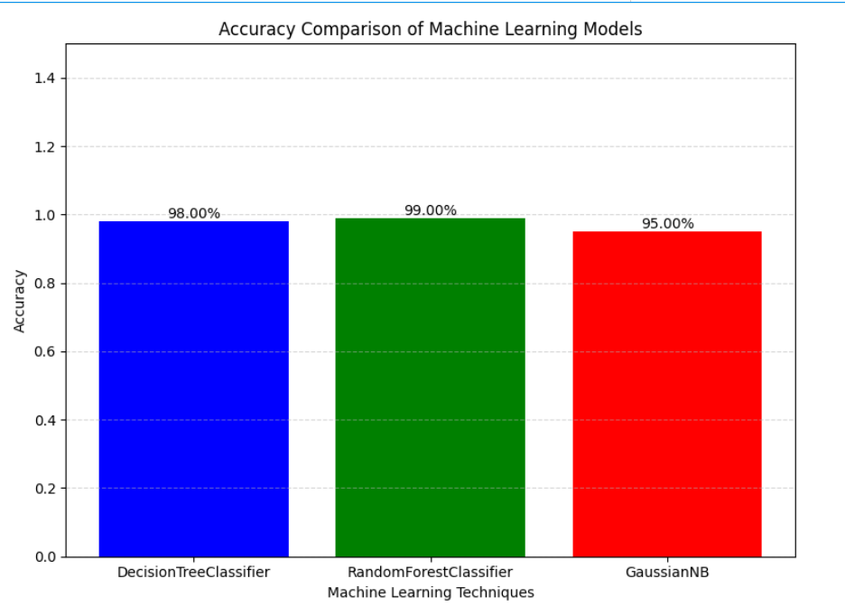

# Stress Level Prediction using Machine Learning

## Project Overview

Stress has become a common issue affecting physical and mental health. This project aims to predict stress levels using physiological and sleep-related parameters by applying machine learning algorithms.

The project analyzes health indicators such as snoring rate, respiration rate, body temperature, blood oxygen level, sleeping hours, and heart rate to classify stress levels into different categories.

---

## Objective

To develop a machine learning model that can accurately predict an individual's stress level based on health and sleep-related attributes.

---

## Dataset Features

The dataset contains the following attributes:

* Snoring Rate
* Respiration Rate
* Body Temperature
* Limb Movement
* Blood Oxygen Level
* Eye Movement
* Sleeping Hours
* Heart Rate
* Stress Level (Target Variable)

---

## Technologies Used

* Python
* Pandas
* NumPy
* Matplotlib
* Scikit-Learn
* Google Colab

---

## Data Preprocessing

The following preprocessing steps were performed before training the models:

1. Loaded the dataset using Pandas.
2. Renamed column names for better readability.
3. Checked dataset structure and summary statistics.
4. Identified missing values.
5. Replaced missing values using mean imputation.
6. Applied StandardScaler for feature scaling.
7. Split the dataset into training and testing sets.

---

## Machine Learning Models Used

### Decision Tree Classifier

A tree-based supervised learning algorithm used for classification.

### Random Forest Classifier

An ensemble learning algorithm that combines multiple decision trees to improve prediction accuracy.

### Naive Bayes Classifier

A probabilistic classification algorithm based on Bayes' theorem.

---

## Model Evaluation

The models were evaluated using:

* Accuracy Score
* Error Rate
* Classification Report

The performance of Decision Tree, Random Forest, and Naive Bayes algorithms was compared to identify the most effective model for stress level prediction.

---

## Visualization

A bar chart was generated using Matplotlib to compare the accuracy of all three machine learning models.

---

## Prediction System

The trained model accepts new health-related input values and predicts the corresponding stress level.

Stress levels are categorized as:

* Low / Normal
* Medium Low
* Medium
* Medium High
* High

Based on the predicted stress level, the system provides appropriate feedback and recommendations.

---

## Project Workflow

1. Data Collection
2. Data Preprocessing
3. Handling Missing Values
4. Feature Scaling
5. Model Training
6. Model Evaluation
7. Accuracy Comparison
8. Stress Level Prediction
9. Feedback Generation

---

## Project Files

* Stress_Level_Prediction.ipynb
* Stress_Level_Prediction.py
* dataset.csv
* Stress_Level_Prediction.pdf

---

## Model Accuracy Comparison

## Conclusion

This project demonstrates how machine learning techniques can be used to analyze physiological and sleep-related factors to predict stress levels. By comparing multiple classification algorithms, the project identifies suitable models for stress prediction and provides practical insights for health monitoring applications.
